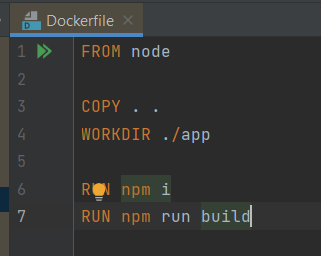
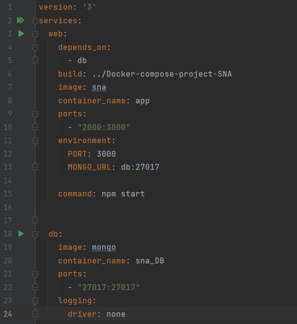
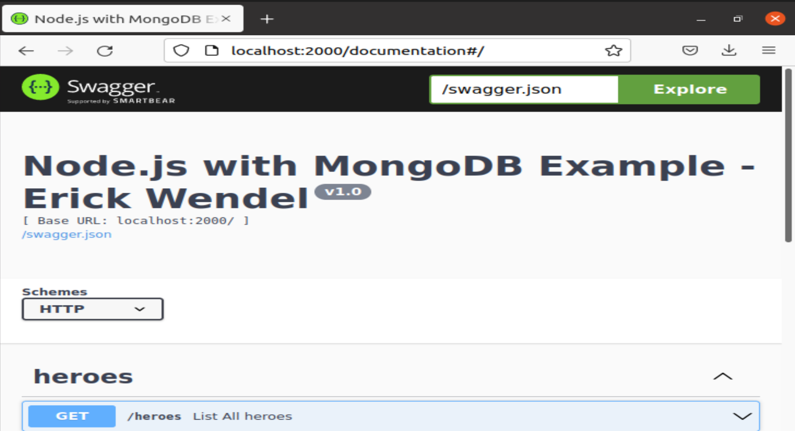

# Docker-compose-project-SNA

## I. Goal/Tasks of the Project

The goal is to deploy our application with frontend and backend by using Docker-Compose 

The demonstration-video is available here: https://www.youtube.com/watch?v=AP6OxASV96c

## II. Execution plan/Methodology

First, we will find some project in github with front-end, back-end, and database.

Then, we will write the Dockerfile and docker-compose in order to run the whole project in the container

## III. Utilization of solution/Tests
We wrote a Dockerfile and docker-compose.

Dockerfile:

docker-compose:

version: `3` — this indicates a version of a Compose file, the latest one is the 3 and that’s way we picked it

Here, we have two services: web and db. 

image — defines the Docker image that will be the base of the web container.

container_name — specifies the name of the outcome container.

environment — here you can define environment variables that will be inside Docker container. 

ports — here we map a port of your PC ( 2000 ) to the exposed port of the container ( 3000 ).

The same definitions apply to db service.

## IV. Difficulties faced

One of the difficulties was to find an appropriate project for our assignment so that there will be front-end, backend, and some database.

We found several project, but not all databases worked as planned. Eventually, we found one project with MongoDB. 

After you clone the project and run the "docker-compose up" command within the directory, you can proceed to the website localhost:2000

## V. Your conclusion, your contemplations and judgement

Docker-compose is a great tool. The big advantage of using Compose is you can define your application stack in a file, keep it at the root of your project repo (it’s now version controlled), and easily enable someone else to contribute to your project. Someone would only need to clone your repo and start the compose app. In fact, there are a few projects on GitHub/GitLab doing exactly this now.

